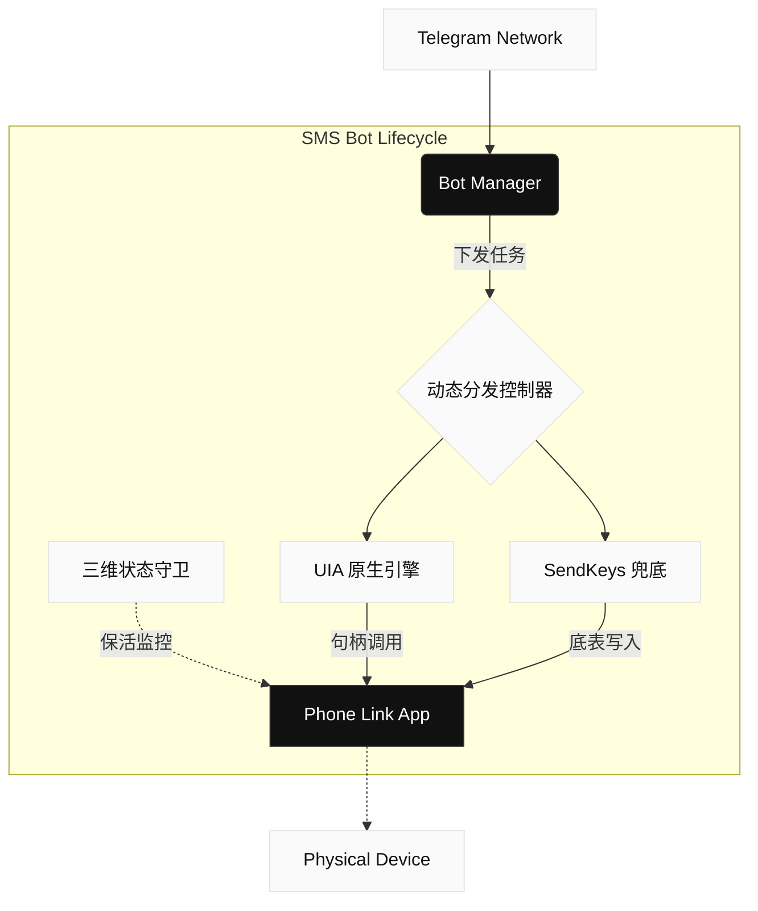

<div align="center">


# SMS Bot v6

**下一代智能 Phone Link 自动化分发引擎** <br />
专为 Windows 环境架构，基于多引擎切换与状态级监控。

<br />

[**🚀 快速启动**](#-快速启动) · [**🏗 架构模型**](#-系统架构) · [**⌨️ 终端交互**](#-终端交互)

</div>

---

## ⚡ 核心定位

SMS Bot v6 彻底抛弃了脆弱的传统按键精灵模式。它是一个深度集成了 Telegram 远程调度与 Windows 本地通信链路的自动化基座。通过引入 **UIA (UI Automation)** 与 **SendKeys 兜底** 双引擎动态切换，实现了针对 Microsoft Phone Link 的像素级操控与极高的投递成功率。

## ✨ 技术特性

- **双引擎自适应调度** — 核心分发系统支持 `auto` 智能模式。当环境 UI 层发生变动或卡顿致使 UIA 无法追踪句柄时，平滑降级至 SendKeys 模拟引擎。
- **三层状态穿透监控** — 独立守护进程实施「进程心跳」「数据库同步律」「窗口假死」三维侦测。一旦 Phone Link 冻结，即刻触发自愈重启机制。
- **优先队列分片** — 发送列队完全接管并发管理。关键测试或加急落地包具备自动抢占最高优先级的特权，保证实时触达。
- **DB 状态硬确认** — 不是无脑执行点击。系统会实时穿透读取本地 `phone.db`，在底层 SQLite 确认状态后才抛出成功回调。

## 🚀 快速启动

本系统要求宿主机具备 **Windows 10/11** 并在本地预装并正常配对连接 Microsoft Phone Link。

```powershell
git clone https://github.com/x72dev/SMS_BOT.git
cd SMS_BOT

# 执行自动化环境装载与依赖解析
python -m bot.setup

# 拉起应用
.\smsbot.bat
```

> [!WARNING]
> **免责声明**
> 本项目仅供个人学习、技术研究及企业内部合规的通知测试使用。严禁用于非法营销轰炸、违规外呼等任何违反所在地法律法规的行为。使用者后果自负。

<details>
<summary><b>环境避坑指南 (Troubleshooting)</b></summary>

<br/>

**1. Phone Link 频繁假死或掉线？**
- **保持屏幕常亮**：Windows 息屏可能导致应用休眠。请在电源设置中关闭“屏幕关闭”和“系统睡眠”。
- **取消后台限制**：将 Phone Link 的后台权限设置为“始终允许”。

**2. 引擎输入错乱？**
当自适应降级至 `SendKeys` 引擎时，**强烈建议将 Windows 系统输入法锁定在英文 (ENG) 状态**，避免输入法层面的编码拦截。
</details>

## 🏗 系统架构



## ⌨️ 终端交互

通过 Telegram 远端进行全生命周期调度，所有操作在对话框内无缝完成。

| 指令 | 描述 |
| :--- | :--- |
| `/batch` | 上传 Excel / 纯文本，解析并发起大批量投递流 |
| `/template` | 基于 `{字段}` 的多维度动态话术模板渲染 |
| `/status` | 返回实时渲染的投递 ETA、分片进度与状态量化面板 |
| `/settings` | 动态干预执行环境，包括频率散列配置与兜底引擎切换 |
| `/activate` | 直接吊起授权管理链路，验证设备硬件指纹 |
